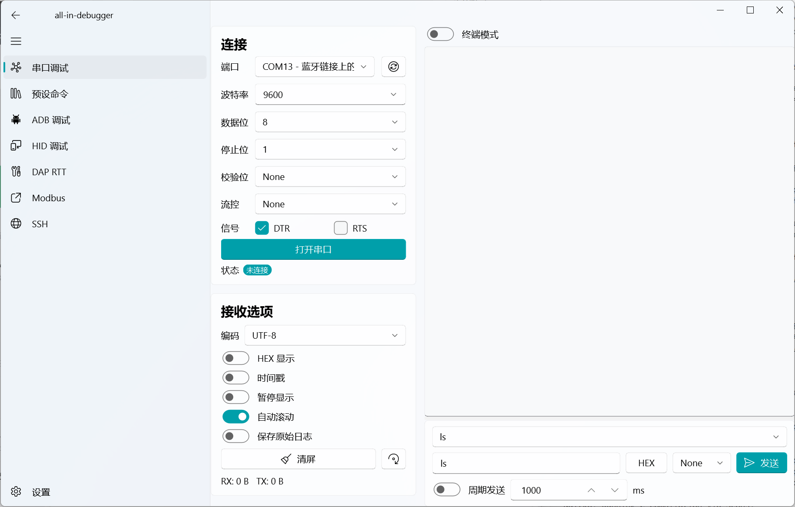
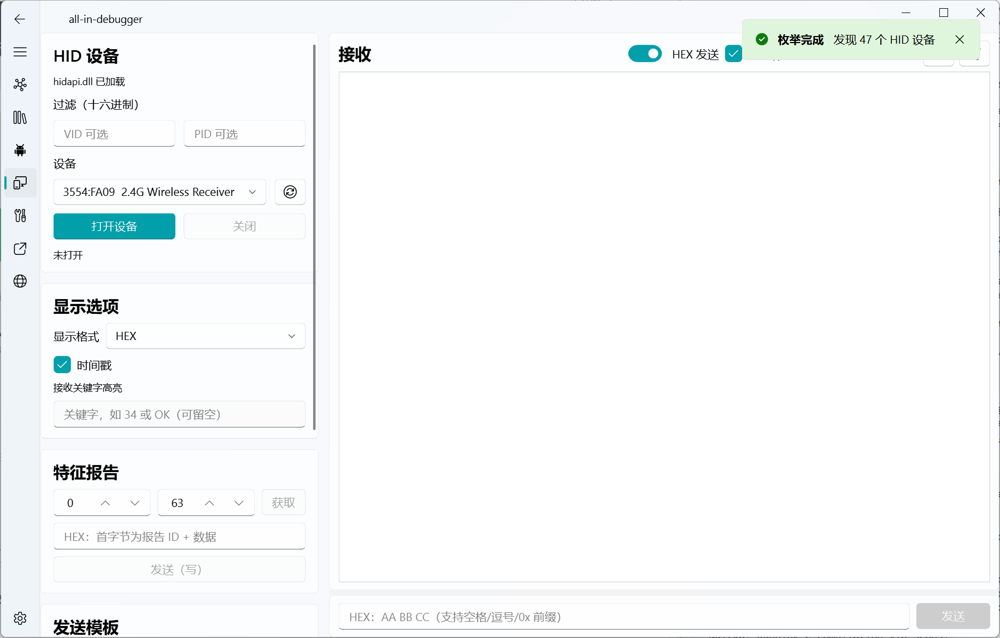
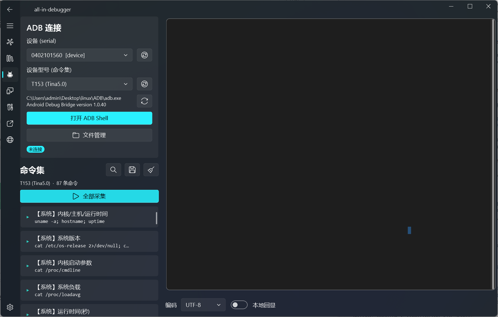

# all-in-debugger

一站式硬件调试工具集：串口 / ADB / USB HID / DAP-link RTT / Modbus / SSH，内嵌 MCP 服务供 AI 客户端调用。

<!-- PROJECT SHIELDS -->

[![Stargazers][stars-shield]][stars-url]
[![Release][release-shield]][release-url]
[![GPLv3][license-shield]][license-url]

<!-- PROJECT LOGO -->
<br />

<p align="center">
  <h3 align="center">all-in-debugger</h3>
  <p align="center">
    一个窗口搞定所有调试协议，告别满桌调试工具！
    <br />
    <a href="https://github.com/BA4IHS/all-in-debugger/releases"><strong>下载发行版 »</strong></a>
    <br />
    <br />
    <a href="https://github.com/BA4IHS/all-in-debugger/releases">查看最新版本</a>
    ·
    <a href="https://github.com/BA4IHS/all-in-debugger/issues">报告Bug</a>
    ·
    <a href="https://github.com/BA4IHS/all-in-debugger/issues">提出新特性</a>
  </p>
</p>

## 项目缘起

你是否厌倦了开许多窗口来调试你的板子——串口一个工具、ADB 一个工具、HID 一个工具、SSH 再开一个终端……窗口越开越多，来回切换苦不堪言。**这款工具就是为解决这个问题而生的**：把常用调试协议全部收进一个 Fluent 风格界面，侧栏一键切换。

本人非计算机专业，本项目全程使用 AI 辅助编程完成。最初由 **MXL8876** 提出想法，在一次次"发现问题 → AI 修复 → 实测验证"的迭代中成长为今天的样子。如果你也想要一个"All in One"的调试台，欢迎 Star、试用和提 Issue。

## 目录

- [功能模块](#功能模块)
- [界面预览](#界面预览)
- [上手指南](#上手指南)
  - [下载运行（推荐）](#下载运行推荐)
  - [源码运行](#源码运行)
  - [测试](#测试)
- [文件目录说明](#文件目录说明)
- [开发的架构](#开发的架构)
- [MCP 服务](#mcp-服务)
- [使用到的框架](#使用到的框架)
- [贡献者](#贡献者)
- [作者](#作者)
- [版权说明](#版权说明)
- [鸣谢](#鸣谢)

## 功能模块

| 模块 | 能力 |
|---|---|
| **串口调试** | 端口热插拔检测、参数全配置、文本/HEX 收发、增量解码（跨包半个汉字不出错）、周期发送、发送历史、原始字节日志 |
| **终端模式** | pyte 仿真 VT100/ANSI 交互终端，彩色/光标/滚屏/回滚、框选复制、本地回显，串口与 SSH/ADB 共用 |
| **预设命令** | 多行命令表格，每行独立 启用/HEX/周期/间隔，JSON 导入导出 |
| **ADB** | 交互 shell 终端、文件管理器（上传/下载/批量删除）、型号指令集可热切换、自带官方 platform-tools |
| **USB HID** | hidapi 设备枚举、HEX/文本收发、特征报告读写、发送模板批量发送 |
| **DAP-link RTT** | 纯 Python CMSIS-DAP/SWD 直连（不依赖厂商 DLL）、IDCODE 读取、SEGGER RTT 多通道收发 |
| **Modbus** | RTU/TCP 主站，FC01–06/15/16；Poll 式网格数据表（每寄存器一格、逐格数据类型、双击写入）、周期轮询 |
| **SSH** | paramiko 交互终端、密码/私钥认证、会话保存（密码不落盘）、SFTP 目录浏览/上传/下载/删除 |
| **内容查找** | 串口日志、各终端 `Ctrl+F` 查找，匹配计数、循环跳转、结果高亮 |
| **主题** | 浅色 / 深色 / 跟随系统，全控件主题自适应 |

> 原生依赖统一放 `app/libs/`（hidapi.dll + 官方 adb 三件套，随程序交付）；缺失时相应页面优雅降级并提示。

## 界面预览

### 串口调试

左侧配置端口参数（波特率/数据位/停止位/校验/流控）与接收选项（编码、HEX 显示、时间戳、自动滚动、原始字节日志），右侧为实时收发区，支持 pyte 终端模式、周期发送与收发字节统计。



### ADB 调试

支持设备选择、型号指令集热切换（一键采集 87 条系统信息）、内置官方 platform-tools、ADB Shell 终端与文件管理器（上传/下载/批量删除）。



### USB HID

枚举/打开 HID 设备，HEX/文本收发、时间戳与关键字高亮，支持特征报告读写与发送模板批量发送。



## 上手指南

### 下载运行（推荐）

1. 到 [Releases](https://github.com/BA4IHS/all-in-debugger/releases) 下载最新 7z 包
2. 解压到**任意可写目录**（请勿放入 Program Files）
3. 直接运行 `all-in-debugger.exe`，无需安装 Python
4. 首次启动会在 exe 旁自动生成 `config.json` / `data.json`，MCP 密钥自动签发

> 系统要求：Windows 10 / 11 x64。若双击无反应，请安装 [VC++ 2015-2022 运行库（x64）](https://aka.ms/vs/17/release/vc_redist.x64.exe)。

### 源码运行

开发前的配置要求：

1. Python 3.10+（与 PyQt6 匹配）
2. ADB 客户端建议 1.0.40+（程序自带，无需额外安装）

安装步骤：

```sh
git clone https://github.com/BA4IHS/all-in-debugger.git
cd all-in-debugger
pip install -r requirements.txt
python main.py
```

> 注意：本项目的 qfluentwidgets 为 **PyQt6** 版本，不要安装 `PyQt5-Fluent-Widgets`（PyQt5/PyQt6 不能混用）。

### 测试

```sh
python -m pytest tests/ -q
```

测试包含纯函数单测与 **无需硬件** 的 worker 端到端测试（pyserial `loop://` 回环、fake paramiko 服务端等），当前 **138 项全部通过**。

## 文件目录说明

```
all-in-debugger/
├── main.py                 # 入口
├── requirements.txt
├── app/
│   ├── config.py           # qconfig 配置 + data.json（历史/预设/会话）
│   ├── serial_utils.py     # 串口纯函数：HEX/解码/换行/端口枚举
│   ├── serial_worker.py    # 串口收发线程（阻塞读循环 + MCP 查询）
│   ├── native.py           # 统一 DLL 加载器（app/libs/）
│   ├── hid_binding.py      # hidapi.dll 绑定（HID 与 DAP 共用）
│   ├── hid_worker.py       # HID 收发线程
│   ├── dap_core.py         # CMSIS-DAP/SWD 协议（HID 直连）
│   ├── dap_rtt.py          # SEGGER RTT 控制块扫描/通道读写
│   ├── dap_worker.py       # DAP/RTT 轮询线程
│   ├── modbus_core.py      # pymodbus 客户端封装 + 收发线程
│   ├── ssh_worker.py       # paramiko SSH/SFTP 线程
│   ├── mcp_bridge.py       # MCP 桥接（跨线程信号转发）
│   ├── mcp_server.py       # 内嵌 MCP 服务（37 个工具）
│   ├── libs/               # hidapi.dll + adb 三件套（随程序交付）
│   └── ui/
│       ├── main_window.py  # SplitFluentWindow 八页面
│       ├── console_page.py # 主调试页（左配置 + 右收发）
│       ├── terminal_widget.py  # pyte 仿真 + 自绘终端
│       ├── preset_page.py / adb_page.py / adb_file_manager.py
│       ├── hid_page.py / dap_page.py / modbus_page.py / ssh_page.py
│       ├── console_style.py    # 日志/终端深色主题适配
│       └── setting_page.py     # 主题/容量/MCP 开关与密钥
└── tests/                  # 纯函数单测 + worker 端到端测试
```

## 开发的架构

统一采用 **worker 线程模式**：每个模块由三部分组成——

1. **Worker**（QThread 内运行）：唯一持有原生句柄（串口/HID/SSH/Modbus 客户端），循环轮询收发
2. **页面**（UI 线程）：纯展示与输入，通过信号与 worker 通信，不直接触碰句柄
3. **MCP 桥接**：把 worker 能力转成 MCP 工具，跨线程用"信号请求 + 事件等待"同步

这样 AI 客户端通过 MCP 调用的每一条命令，与你在界面上点击的操作走完全相同的代码路径。

## MCP 服务

内嵌 streamable HTTP MCP 服务（FastMCP + uvicorn），向 AI 客户端暴露 **37 个调试工具**：

- 仅监听 `127.0.0.1`，Bearer Token 鉴权，默认关闭，设置页可开关
- 覆盖串口 / HID / DAP-RTT / Modbus / SSH / ADB 的状态查询、连接、收发、读写寄存器、文件传输
- 首次启动自动生成密钥（绝不覆盖），设置页一键复制 AI 客户端接入配置

## 使用到的框架

- [PyQt6](https://www.riverbankcomputing.com/software/pyqt/) — GUI 基础
- [qfluentwidgets](https://qfluentwidgets.com) — Fluent 风格控件
- [pyserial](https://pyserial.readthedocs.io) — 串口通信
- [pyte](https://github.com/selectel/pyte) — VT100/ANSI 终端仿真
- [pymodbus](https://pymodbus.readthedocs.io) — Modbus RTU/TCP
- [paramiko](https://www.paramiko.org) — SSH/SFTP
- [FastMCP + uvicorn](https://github.com/modelcontextprotocol/python-sdk) — 内嵌 MCP 服务
- [Nuitka](https://nuitka.net) — 原生编译打包

## 贡献者

感谢所有参与本项目的开发者，完整名单见[贡献者列表](https://github.com/BA4IHS/all-in-debugger/graphs/contributors)。

## 作者

**MXL8876** 提出最初想法，BA4IHS 借助 AI 编程实现与维护。

GitHub: [BA4IHS](https://github.com/BA4IHS)

*您也可以在贡献者名单中参看所有参与该项目的开发者。*

## 版权说明

本项目采用 **GNU GPLv3** 授权许可，详情请参阅 [LICENSE](LICENSE)。

选择 GPLv3 的原因：核心依赖 PyQt6 与 qfluentwidgets 均为 GPLv3（GPL 具有传染性，衍生作品必须以相同协议发布）。其余依赖均与 GPLv3 兼容：

| 依赖 | 协议 | 兼容性 |
|---|---|---|
| PyQt6 | GPLv3（或商业许可） | 决定项目协议 |
| qfluentwidgets | GPLv3（非商用） | 决定项目协议 |
| pyserial / pyte / pymodbus | BSD | ✅ 兼容 |
| paramiko | LGPL-2.1 | ✅ 兼容 |
| mcp (Python SDK) | MIT | ✅ 兼容 |
| hidapi.dll | GPLv3 / BSD-3 / 原始许可 三选一 | ✅ 随本项目按 GPLv3 使用 |
| adb 三件套 | Apache-2.0（Google 官方 platform-tools，子进程调用） | ✅ 兼容 |

> 若您希望商业闭源分发，需同时向 Riverbank（PyQt6）与 qfluentwidgets 作者购买商业许可证。

## 鸣谢

- [Best_README_template](https://github.com/shaojintian/Best_README_template) — 本 README 模板来源
- [Img Shields](https://shields.io) — 徽章生成
- [SEGGER RTT](https://www.segger.com/products/debug-probes/j-link/technology/about-real-time-transfer/) — RTT 协议参考
- [CMSIS-DAP](https://arm-software.github.io/CMSIS_5/DAP/html/index.html) — DAP 协议规范

<!-- links -->
[stars-shield]: https://img.shields.io/github/stars/BA4IHS/all-in-debugger.svg?style=flat-square&cb=20260803
[stars-url]: https://github.com/BA4IHS/all-in-debugger/stargazers
[release-shield]: https://img.shields.io/github/v/release/BA4IHS/all-in-debugger.svg?style=flat-square&cb=20260803
[release-url]: https://github.com/BA4IHS/all-in-debugger/releases
[license-shield]: https://img.shields.io/badge/license-GPLv3-blue.svg?style=flat-square
[license-url]: https://github.com/BA4IHS/all-in-debugger/blob/main/LICENSE
